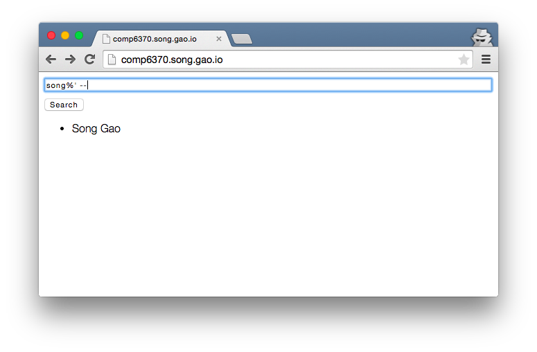

# COMP6370 CA03 Report - Database Injection

November 9, 2014 | [Song Gao](https://song.gao.io/) / szg0031

## Introduction

A simple web application is built to demonstrate a particular kind of security breach - SQL injection, where an attacker can execute malicious database queries by entering carefully created strings into an input on the web application which is then used by back-end to perform database queries.

For example, assuming the back-end would perform following query:

```sql
SELECT * FROM users WHERE name='?'
```

where `?` is the content from a user entered string. If the back-end does not sanitize/escape the user entered string, special SQL charactered can slip into the query and perform malicious operations. For example: one could enter `John Doe'; DROP TABLE users; --`, which makes the query become:

```sql
SELECT * FROM users WHERE name='John Doe'; DROP TABLE users; --'
```

`--` makes everything afterwards a comment, being ignored by the SQL engine. For some database interfaces where multiple query can be executed, this can drop the entire `users` table.

## Implementation

Please see the last section for full source code, but here's the key part:

```go
func (s *brokenServer) handleSearch(w http.ResponseWriter, r *http.Request) {
        query := "SELECT name FROM Names WHERE name like '%" + r.URL.Query().Get("name") + "%'"
        rows, err := s.db.Query(query)

        if err != nil {
                io.WriteString(w, err.Error())
                return
        }
        var name string
        var names []string
        for rows.Next() {
                err := rows.Scan(&name)
                if err == nil {
                        names = append(names, name)
                }
        }
        json.NewEncoder(w).Encode(names)
}
```

This method handles the `/search?name=...` AJAX call. In Go's SQL package `database/sql`, `DB.Query` has following signature:

```go
func (db *DB) Query(query string, args ...interface{}) (*Rows, error)
```

`args` is for inserting arguments into the query. The library would sanitize and escape the arguments, making sure it won't cause side-effects while being executed by the SQL engine. However, in above code, `args` is not used, however, a string is constructed out of user input and used directly as the SQL query. This skips the escaping and can be dangerous. See the section "Demo" for and attack in action. Fortunately, the SQL library being used doesn't allow executing multiple queries in one `Query` call, so `DROP TABLE` can't be performed using this security breach. Well, at least I couldn't pull that off. Although sub-queries can be used in the `SELECT` statement, it seems that the sub-queries can only be `SELECT` statements as well.

A proper way to implement the above functionality would be:

```go
rows, err := s.db.Query("SELECT name FROM Names WHERE name like '%?%'", r.URL.Query().Get("name"))
```

## Demo

Open the page [http://comp6370.song.gao.io/](http://comp6370.song.gao.io/), the browser shows following page. The page does one simple thing: searching for people in the database.


Following screenshot shows how a normal operation is done. A string `"song"` is entered and the database searches in all names for the ones that contains `"song"`, and returns "Song Gao" - the only one that matches.


Now let's try and see if the back-end sanitizes the input, by entering `song%' --`. If the back-end sanitizes the input, this should return nothing; otherwise, it would return exactly the same thing as we had in last screenshot.



Bang! Security breach! Here's something fun. Let's enter `song%' or (1=1) --`. This effectively invalidates the `name='%?%'` condition, and returns all names in the database:


Now, this doesn't seem to be very harmful, but if the same security breach exists in a system used to query sensitive information, this can lead to information leaking. For example, a system can have a table that stores private messages, and a client API call is provided to query personal message history. If injection is possible here, a malicious user can create a query that pulls other people's private messages.

## Source Code

```go
package main

import (
  "database/sql"
  "encoding/json"
  "fmt"
  "io"
  "net/http"
  "time"

  _ "github.com/mattn/go-sqlite3"
)

type brokenServer struct {
  db  *sql.DB
  mux *http.ServeMux
}

func newBrokenServer() (server *brokenServer, err error) {
  server = new(brokenServer)
  server.db, err = sql.Open("sqlite3", "db.sqlite3")
  if err != nil {
    return
  }

  go func() {
    for {
      // In case some really good hacker managed to DROP TABLE, this ensures
      // the table gets reconstructed every once a while so that the demo still
      // works. If you are this awesome hacker, please don't keep dropping my
      // table. I need it to be graded for my security class. Do leave a
      // comment though :D

      server.initTable()
      time.Sleep(60 * time.Second)
    }
  }()

  server.mux = http.NewServeMux()
  server.mux.HandleFunc("/", server.handleIndex)
  server.mux.HandleFunc("/search", server.handleSearch)

  return
}

func (s *brokenServer) initTable() {
  rows, err := s.db.Query("SELECT name FROM sqlite_master WHERE type='table'")
  if err != nil {
    fmt.Println(err)
    rows.Close()
    return
  }
  found := false
  for rows.Next() {
    var name string
    err = rows.Scan(&name)
    if name == "Names" {
      found = true
      break
    }
  }
  rows.Close()

  if found {
    _, err = s.db.Exec("DROP TABLE Names")
    if err != nil {
      fmt.Println(err)
      return
    }
  }
  _, err = s.db.Exec("CREATE TABLE Names(name varchar(64))")
  if err != nil {
    fmt.Println(err)
    return
  }
  for _, name := range names {
    _, err = s.db.Exec("INSERT INTO Names(name) VALUES(?)", name)
    if err != nil {
      fmt.Println(err)
      return
    }
  }
}

func (s *brokenServer) handleIndex(w http.ResponseWriter, r *http.Request) {
  io.WriteString(w, index)
}

func (s *brokenServer) handleSearch(w http.ResponseWriter, r *http.Request) {
  query := "SELECT name FROM Names WHERE name like '%" + r.URL.Query().Get("name") + "%'"
  rows, err := s.db.Query(query)
  // security bug here ^^ . Proper way is to use built-in args parameters, which
  // sanitize/escape input. For example:
  // rows, err := s.db.Query("SELECT name FROM Names WHERE name like '%?%'", r.URL.Query().Get("name"))

  if err != nil {
    io.WriteString(w, err.Error())
    return
  }
  var name string
  var names []string
  for rows.Next() {
    err := rows.Scan(&name)
    if err == nil {
      names = append(names, name)
    }
  }
  json.NewEncoder(w).Encode(names)
}

func (s *brokenServer) run() {
  http.ListenAndServe(":8080", s.mux)
}

func main() {
  server, err := newBrokenServer()
  if err != nil {
    fmt.Println(err)
    return
  }
  server.run()
}

const index = `
<!DOCTYPE html>
<html lang="en">
<head>
  <meta charset="UTF-8">
  <title></title>
  <style>
  html {
    font-family: "HelveticaNeue-Light", "Helvetica Neue Light", "Helvetica Neue", Helvetica, Arial, "Lucida Grande", sans-serif;
  }
  input {
    width: 640px;
    margin-bottom: 8px;
  }
  li {
    margin-top: 4px;
  }
  </style>
</head>
<body>
<div><input type="textbox" id="textName" placeholder="Name"></div>
<button id="btnSearch">Search</button>
<div id="result"></div>

<script src="https://code.jquery.com/jquery-2.1.1.min.js"></script>
<script>
var showResult = function(result) {
  if (!result || ! result.length) {
    return;
  }
  var lis = result.map(function(item) {
    return '<li>' + item + '</li>';
  });
  $('#result').html('<ul>' + lis.join("") + '</ul>');
};
var req = function(url) {
  $.ajax({
    url: url,
    dataType: "json",
  }).done(function(data) {
    showResult(data);
  }).fail(function(_, status, err) {
    $('#result').html(status + '<br>' + err);
  });
};
$('#btnSearch').click(function(e) {
  var url = '/search?name=' + encodeURIComponent(document.getElementById('textName').value);
  req(url);
});
$('#textName').keypress(function(e){
  if(e.keyCode == 13) {
    $('#btnSearch').click();
  }
});
</script>
</body>
</html>
`

var names = []string{ // exported from Canvas
  "Helen Agha",
  "Olabode Anise",
  "Robert Baldwin",
  "Christopher Barrow",
  "Mackenzie Bartus",
  "Charles Black",
  "Christopher Boling",
  "Adam Brown",
  "Alexander Calvert",
  "William Champion",
  "Ethan Coggin",
  "James Coker",
  "Adam Coleman",
  "Jacob Conaway",
  "Benjamin Dill",
  "Timothy Dodge",
  "John Kyle Doggett",
  "Kyle Doud",
  "Carlos Daniel Drury",
  "Benjamin Fogel",
  "William Frazier",
  "Song Gao",
  "Matthew Garmon",
  "Daniel Golden",
  "Christina Grajales",
  "Nicole Harris",
  "Lakisha Hartline",
  "Brian Jennings",
  "David Jones",
  "Michael Jones",
  "Donovan Jordan",
  "Michael Katica",
  "Ryan Lewis",
  "Jonathan Lindsey",
  "Quentin Lowery",
  "Thomas Lowry",
  "Taylor Lucy",
  "Nathanael Lyles",
  "Ethan Mata",
  "Calvin Montgomery",
  "Joshua Moore",
  "Tausif Muzaffar",
  "Mary Odum",
  "Andrew Oliver",
  "John Prewitt",
  "Victoria Richardson",
  "Isaac Roby",
  "Lucas Saltz",
  "Justin Self",
  "Robert Skelton",
  "Benjamin Skipper",
  "Austin Sorrells",
  "Ross Spears",
  "Sean Spurlin",
  "Angela Stewart",
  "Rebekah Still",
  "Kenneth Streit",
  "Nawrin Sultana",
  "Andrew Taylor",
  "Fatma Neda Topuz",
  "David Umphress",
  "Francis Zayek",
}
```
